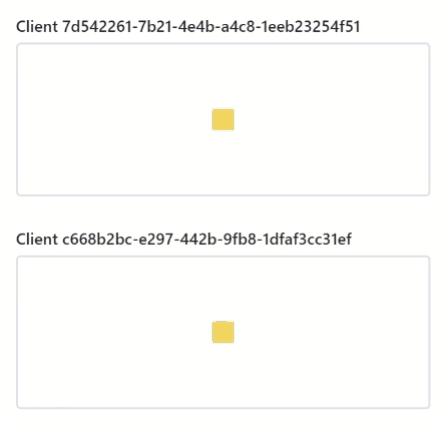
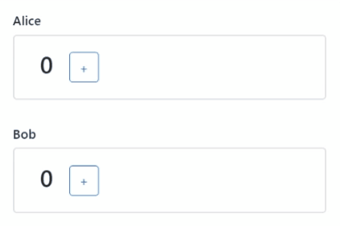

# co-share

[](https://github.com/cocoss-org/co-share/actions)&nbsp;
[](https://npmjs.com/package/co-share)&nbsp;
[](https://github.com/cocoss-org/co-share/blob/master/LICENSE)&nbsp;
[](https://twitter.com/BelaBohlender)

Javascript framework for easily building shared applications such as chats and games



*[Example](https://cocoss-org.github.io/co-share/transformable/) built with `co-share` and [react-three-fiber](https://github.com/pmndrs/react-three-fiber)*

`npm i co-share`

## **When to use**

Building **multiuser applications for the web** is often challenging as asynchronous communication can drastically increase the system complexity.
Writing **robust and performant shared applications** requires a structured and fitting architecture.

We propose the abstraction of **shared stores** to distribute logic and data between participating systems.
By using Javascript & Node.js, the same code can be used on the client and the server to carry out the **platform-independent communication**.

## **How to use**

The library is framework-independent as it runs on the `Web` and `NodeJS`. However, we provide `react` hooks out of the box to simplify the experience. _Please help us to build tools for more web frameworks._

```typescript
new Example extends Store {
    action = Action.create(this, "actionName", (origin, parameter) => {
        action.publishTo(
            origin == null ?
                { to: "all" } :
                { to: "all-except-one", except: origin },
            parameter
        )
    })
}
```

The `Stores` contain both, the **platform-independent logic** and the **data**. Platform independent logic is specified as `Action`s, which are methods that can be invoked on a remote client (similar to RPC/RMI). Above, we use `publishTo` to make the **Store** execute the given **Action** with the provided `parameter` on all nodes linked to this **Store**.

## [**Tutorial**](https://cocoss-org.github.io/co-share/counter)


We will build a globally synchronized counter and display it using `react`. Every client can increase the counter.



Above, you can see a local simulation with the clients "Alice" and "Bob". Even though we can simulate the communication locally, this library is meant for **networked communication** using WebSocket or WebRTC.

## [**Examples**](https://cocoss-org.github.io/co-share)

_The code for each example can be found on the respective pages_

### Simulated locally in your browser

-   [Request](https://cocoss-org.github.io/co-share/request) - request response paradigma
<!-- * [Group Chat](https://cocoss-org.github.io/co-share/group-chat) - a whatsapp like chat implementation -->
-   [Message](https://cocoss-org.github.io/co-share/message) - direct client to client messaging without any persistent storage in between
-   [Lockable](https://cocoss-org.github.io/co-share/lockable) - advanced lock functionality to prevent editing by multiple people simultaneously
-   [Optimistic Lockable](https://cocoss-org.github.io/co-share/optimistic-lockable) - performance optimize lockable that allows for optimistic behaviour and error correction
-   [Whiteboard](https://cocoss-org.github.io/co-share/whiteboard) - collaborative drawing on a shared whiteboard
-   [Transformable](https://cocoss-org.github.io/co-share/transformable) - shared 3D transformation

### An extra Project with a server/client architecture using SocketIO

-   [Networked Counter using SocketIO](https://github.com/cocoss-org/co-share-socketio-counter-example) - just like the counter from the tutorial but with a server/client architecture using SocketIO

## Example Architecture


In a multiuser scenario, stores are connected using `StoreLink`s. One **Store** can have 0-N `StoreLink`s to other participants.

## **In depth description**

This framework revolves around the idea of **Stores**, which can represent any entity or information. A **Store** is a class that may contain a set of **Actions** which are methods that can be executed remotely. The communication for executing an action remotely is carried out by the connection of your choice, for instance, with socketio.

However, executing an **Action** requires an established **StoreLink** for a connection. This **StoreLink** uniquely identifies the relation between local **Store** and remote **Store** and vice versa.
Setting up a **StoreLink** can be done manually or automatically by **subscribing** to a certain **Store**. When subscribing to a **Store** from a host, its **Store** will provide the initial parameters to create a local copy of that **Store**. A **Subscriber** provides the parameters running on every **Store** to determine if and what a requesting client should know about the **Store**. **Subscribers** can also deny a subscription request.

## Supporting Packages

-   [**co-share-socketio**](https://github.com/cocoss-org/co-share-socketio) - networking implementation using [socketio](https://github.com/socketio/socket.io)
-   **co-share-peer** - _Comming Soon_ - p2p networking/streaming implementation using [simple-peer](https://github.com/feross/simple-peer)
<!---   **co-share-geckosio** - _Idea_ - networking implementation using [geckosio](https://github.com/geckosio/geckos.io)-->
