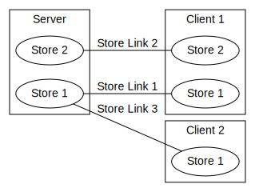

# co-share

Architecting shared applications using js & node.js.

`npm i co-share`

## **Why?**

Building **multiuser applications for the web** is often challenging as asynchronous communication can drastically increase the system complexity.
Writing **robust and performant shared applications** requires a structured and fitting architecure.

We propose the abstraction of **shared stores** to distribute logic and data between participating system.
By using js & node.js the same code can be used on the client and on the server to carry out the **platform indepedent communication**.

## **How to use**

The library is framework independent as it runs on the `Web` and `NodeJS`. However, we provide `react` hooks out of the box to simplify the experience. *Please help us to build tools for more web frameworks.*

```typescript
new Example extends Store {
    action = Action.create(this, "actionName", (origin, parameter) => {
        action.publishTo(
            origin == null ?
                { to: "all" } :
                { to: "all-except-one", except: origin },
            parameter
        )
    })
}
```

The `Stores` contain the platform **platform indepedent logic** and **data**. `Stores` can contain `Action`s, which can remote method invocation. Above we use `publishTo` to make the targetted store execute the action with the provided `parameter`.


## [**Examples**](https://cocoss-org.github.io/co-share)

* [Counter](https://cocoss-org.github.io/co-share/counter) - a global synchronized counter that can be increased asynchronously by every client
* [Request](https://cocoss-org.github.io/co-share/request) - request response paradigma
* [Group Chat](https://cocoss-org.github.io/co-share/group-chat) - a whatsapp like chat implementation
* [Message](https://cocoss-org.github.io/co-share/message) - direct client to client messaging without any persistent storage in between
* [Lockable](https://cocoss-org.github.io/co-share/lockable) - advanced lock functionality to prevent editing by multiple people simultaneously 
* [Optimistic Lockable](https://cocoss-org.github.io/co-share/optimistic-lockable) - performance optimize lockable that allows for optimistic behaviour and error correction
* [Whiteboard](https://cocoss-org.github.io/co-share/whiteboard) - collaborative drawing on a shared whiteboard
* [Transformable](https://cocoss-org.github.io/co-share/transformable) - shared 3D transformation

## Example Architecture



In a multiuser scenario stores are connected using `StoreLink`s. One Store can have 0-N `StoreLink`s to other participants.

## **In depth description**

This framework revolves arround the idea of **Stores**, which can represent any entity or information. **Stores** are classes which can contain **Actions**. **Actions** are methods that can be executed remotely. The communication to enable this execution is carried out by the specific connection, e.g. using socketio.

However, executing a **Action** requires an established **StoreLink** for a connection. This **StoreLink** uniquely identies the relation between local store and remote store and vice verca.
Setting up a **StoreLink** can either be done manually or automatically through **subscribing** to a certain **Store**. Through subscribing to a **Store** initial parameters are fetched from the host **Store**. The parameters are provided by a **Subscriber** running on every **Store** to determine if and what a requesting client should know about the **Store**.

**Store**s can be organized in a hierachical mannor since every store saves a list of child **Store**, which can be adapted at runtime. **Subscribing** to a **Store** requires to execute the _requestSubscribeToChild_ **Request**, which exists on every **Store**. **Request**s are defined through **Action**s internally and allow to have asynchrounous return values for remote logic invocation.

## Supporting Packages

-   **co-share-socketio** - networking implementation using [socketio](https://github.com/socketio/socket.io)
-   **co-share-peer** - p2p audio/video/data streaming/communication using [simple-peer](https://github.com/feross/simple-peer)
-   **co-share-geckosio** - _Idea_ - networking implementation using [geckosio](https://github.com/geckosio/geckos.io)
